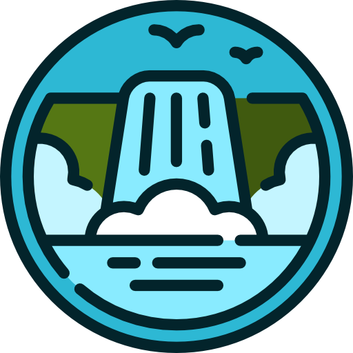

# Pasatiempo en Cascada

  

  

Este repositorio desarrolla un Pasatiempo en Cascada básico.

## Tecnologías

Se ha utilizado  
 con  
 y  

## Manual de uso

Identifique la primera palabra y la última de cada bloque con las pistas que se dan. A continuación, trate de descubrir las palabras intermedias. 
Para lograrlo, cambie una letra de la primera palabra para obtener la próxima y, después altere el orden de una o varias letras para encontrar la siguiente. 
Siga así, sucesivamente, hasta que logre completar ambos casilleros. Todas las palabras intermedias deben tener significado.

Dispone de un campo de pistas para buscar si una palabra esta o no en el diccionario. Pero cuidado, solo tiene 3 busquedas.

Si consigue resolver el pasatiempo este cambiara a verde, por el contrario se rellenara de rojo.

